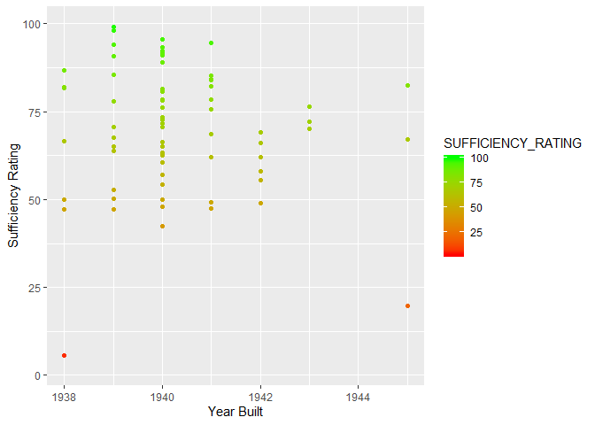

    bridges = read_csv("PA18.txt")

    ## Parsed with column specification:
    ## cols(
    ##   .default = col_double(),
    ##   STRUCTURE_NUMBER_008 = col_character(),
    ##   ROUTE_NUMBER_005D = col_character(),
    ##   HIGHWAY_DISTRICT_002 = col_character(),
    ##   COUNTY_CODE_003 = col_character(),
    ##   FEATURES_DESC_006A = col_character(),
    ##   CRITICAL_FACILITY_006B = col_logical(),
    ##   FACILITY_CARRIED_007 = col_character(),
    ##   LOCATION_009 = col_character(),
    ##   LRS_INV_ROUTE_013A = col_character(),
    ##   LONG_017 = col_character(),
    ##   MAINTENANCE_021 = col_character(),
    ##   OWNER_022 = col_character(),
    ##   FUNCTIONAL_CLASS_026 = col_character(),
    ##   DESIGN_LOAD_031 = col_character(),
    ##   RAILINGS_036A = col_character(),
    ##   TRANSITIONS_036B = col_character(),
    ##   APPR_RAIL_036C = col_character(),
    ##   APPR_RAIL_END_036D = col_character(),
    ##   NAVIGATION_038 = col_character(),
    ##   OPEN_CLOSED_POSTED_041 = col_character()
    ##   # ... with 43 more columns
    ## )

    ## See spec(...) for full column specifications.

    ## Warning: 135 parsing failures.
    ##  row                     col           expected          actual       file
    ## 3644 OTHER_STATE_CODE_098A   1/0/T/F/TRUE/FALSE 342             'PA18.txt'
    ## 3644 OTHR_STATE_STRUC_NO_099 1/0/T/F/TRUE/FALSE 000000003000002 'PA18.txt'
    ## 3646 OTHER_STATE_CODE_098A   1/0/T/F/TRUE/FALSE 342             'PA18.txt'
    ## 3646 OTHR_STATE_STRUC_NO_099 1/0/T/F/TRUE/FALSE 000000000000000 'PA18.txt'
    ## 3677 OTHER_STATE_CODE_098A   1/0/T/F/TRUE/FALSE 342             'PA18.txt'
    ## .... ....................... .................. ............... ..........
    ## See problems(...) for more details.

    AllegCountyData = bridges %>%  filter(str_detect(COUNTY_CODE_003, "003"))  %>%  select(COUNTY_CODE_003, YEAR_BUILT_027, SUFFICIENCY_RATING) %>%  arrange(desc(YEAR_BUILT_027)) %>% ggplot(aes(x = YEAR_BUILT_027, y = SUFFICIENCY_RATING, color = SUFFICIENCY_RATING)) + geom_point()  + xlim(1938, 1945) + scale_color_gradient(low="red", high="green") + xlab("Year Built") + ylab("Sufficiency Rating")

    AllegCountyData

    ## Warning: Removed 1218 rows containing missing values (geom_point).

    # I chose to look at the most recent bridges data from Pennsylvania because I recently went on a trip there to watch the Badger women's volleyball team play in national championship. While I was there, I learned that Pittsburgh itself is home to over 400 bridges. Genny and I helped each other out during this homework. After loading the data into R, I decided the best way to analyze only bridges in the Pittsburgh area was to filter by county (Alleghany County). After reading more into the data, the sufficiency rating, or quality rating, of these bridges really interested me. I wanted to see the spread in quality of bridges made by year, and decided to specifically focus on the time period during World War II. In 1938 we see a very large spread, from ratings of around 10 to 87. From 1939-1942, we see far less spread in ratings, as well as more bridges being built. 1943 only saw 3 bridges built, but all three have sufficiency ratings between about 65 and 75. I was shocked to see 1944 did not see any bridges built at all, as there are not many years that Pennsylvania built no bridges. Finally in 1945, only three bridges were built again, but their spread was quite significant, ranging from about 23 to 85. Overall, one can conclude from this graph that the end of  World War II lead to a strong decrease in bridges being built, and many bridges built during this time have a high variation in quality ratings today.
